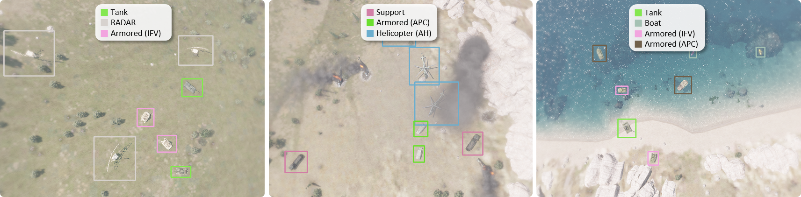

<h1 align="center" style="font-weight: 500; line-height: 1.4;">
  Learning robust representation for military target detection with class-wise prediction regularization
</h1>

  
  
  

  <b><a href="https://github.com/unique-chan">Yechan Kim</a></b> and
  <b><a href="https://github.com/citizen135">Jong Hyun Park</a></b>

### This repo includes:
- Official implementation for our proposed approach
- Open dataset for AMD-v1

### Preview

  

